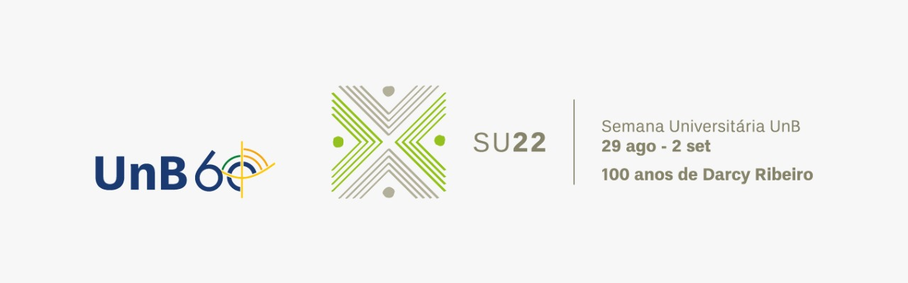

# Para Começar a Programar: Curso de Básico de Python

Este curso faz parte da Semana Universitária 2022 da Universidade de Brasília, evento que tem como tema a comemoração dos 100 anos de Darcy Ribeiro e dos 60 anos da UnB.

Mais informações sobre a SU22 podem ser encontradas em

http://dex.unb.br/semanauniversitariaunb

O curso, ministrado por Adriano Possebon Rosa, professor da Faculdade de Tecnologia da UnB, acontece entre os dias 29/08/2022 e 02/09/2022. 

São 5 aulas no total, com 2 horas cada. 

A programação completa do curso e todos os outros detalhes estão no arquivo

> **SU22_Curso_de_Python_Slides.pdf** 

O curso completo (com todos os códigos) está no arquivo 

> **SU22_Curso_de_Python_Jupyter.ipynb**

O curso completo também está em formato pdf, no arquivo

> **SU22_Curso_de_Python_Jupyter.pdf**

e em formato html,

> **SU22_Curso_de_Python_Jupyter.html**

Link para o grupo no WhatsApp: https://chat.whatsapp.com/IrzMDHHudNEIsa1zfKdksZ 

Se você tiver críticas, sugestões e/ou comentários sobre este material por favor me envie uma mensagem (aprosa@unb.br).
